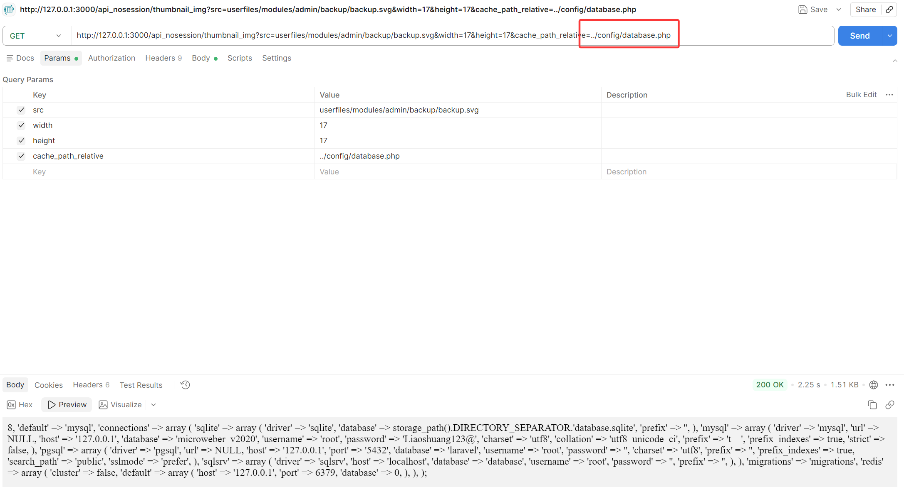
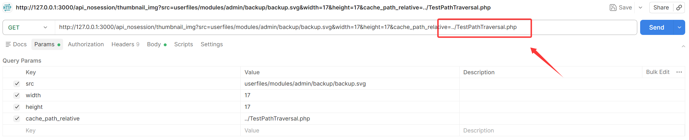
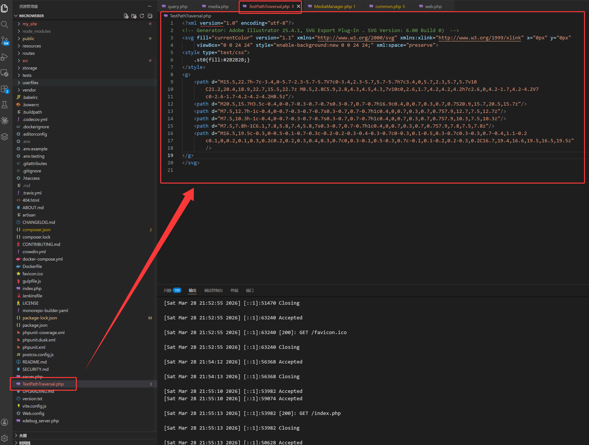
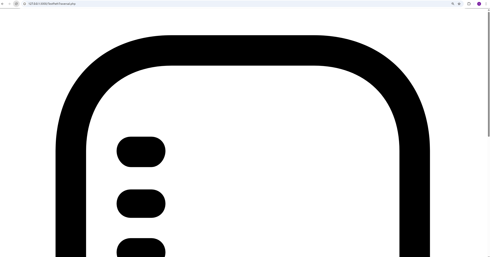
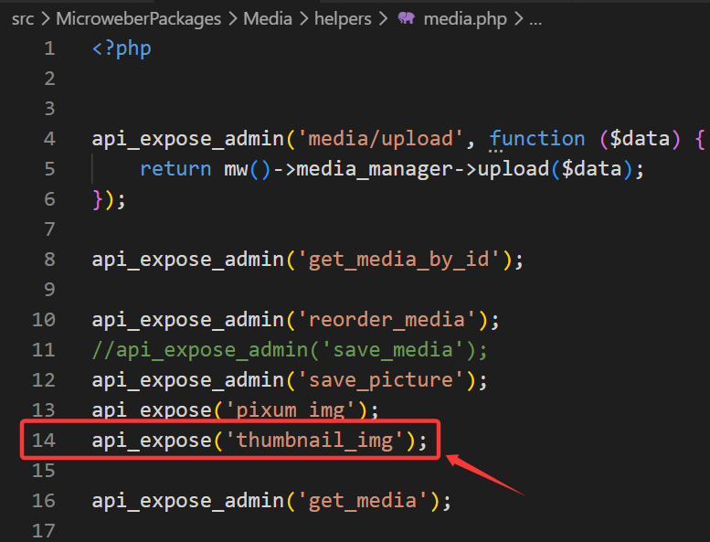
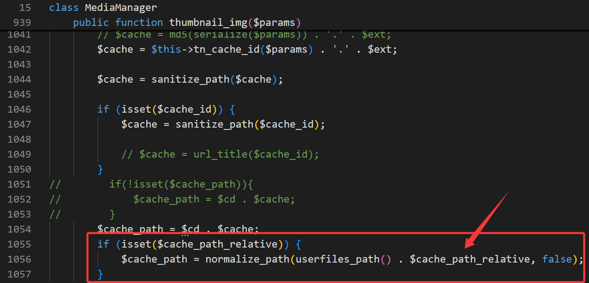
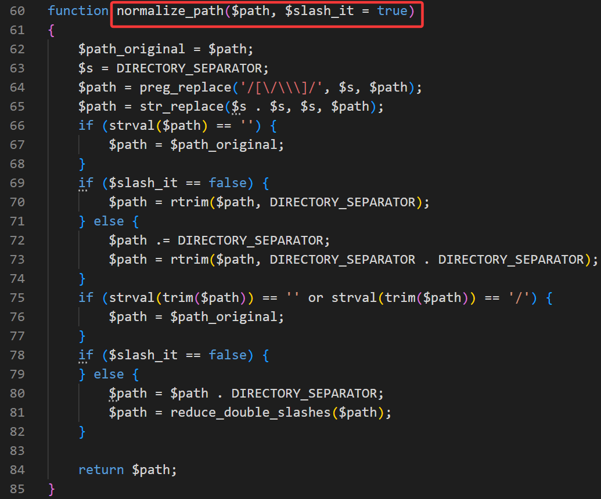
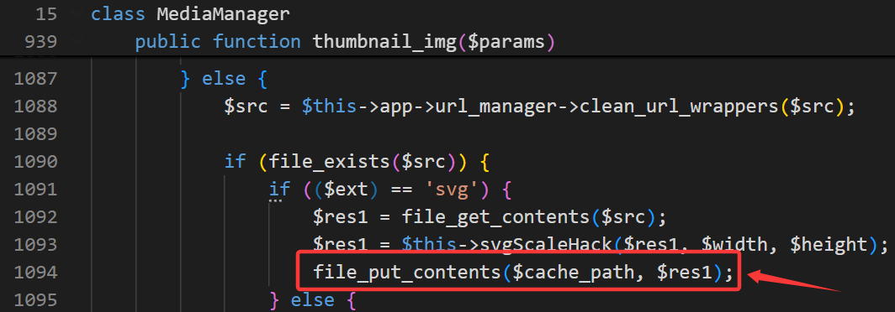
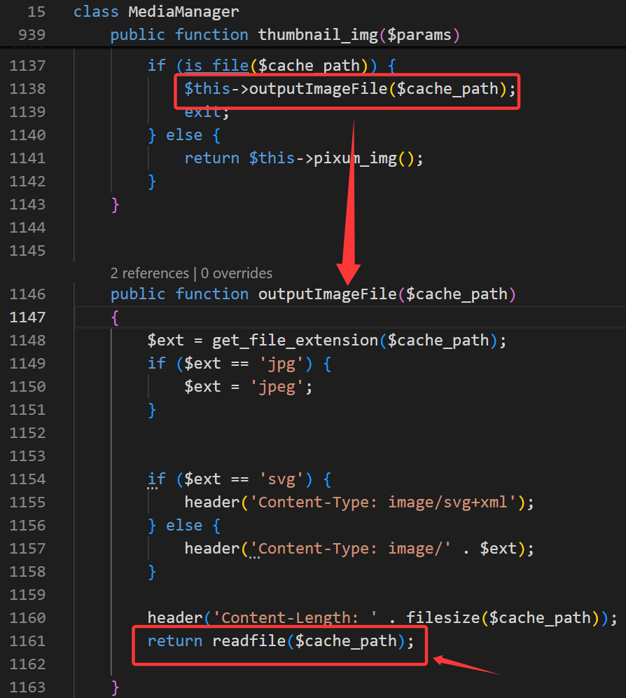

# Unauthenticated Arbitrary File Read and Path-Controlled File Write via `/api_nosession/thumbnail_img` in Microweber v2.0.20

## Summary

Microweber v2.0.20 exposes a hidden public API endpoint, `/api_nosession/thumbnail_img`, that does not properly validate the `cache_path_relative` parameter before using it in filesystem path construction. Because traversal sequences such as `../` are not removed, an unauthenticated attacker can escape the intended thumbnail cache path.

Under the tested conditions, this behavior can be used for arbitrary file read and path-controlled file write.

## Vendor

Microweber

## Product

Microweber

## Affected Version

- Microweber v2.0.20
- Other versions have not been verified yet

## Vulnerability Type

- Path Traversal
- CWE-22

## Attack Requirements

- No authentication is required
- The vulnerable endpoint is publicly reachable

## Affected Endpoint

- `/api_nosession/thumbnail_img`

## Technical Root Cause

The endpoint accepts the `cache_path_relative` parameter and uses it to influence the output path under `userfiles_path()`. The value is passed through `normalize_path()`, but that helper normalizes separators and formatting only; it does not strip traversal sequences such as `../`.

As a result:

1. If the attacker points the cache path to an existing file, that file may later be returned directly to the client.
2. If the source image is a local SVG file, the endpoint may write attacker-influenced output to a path outside the intended thumbnail directory.

## Impact

An unauthenticated attacker may be able to:

1. Read arbitrary files reachable from the affected application path handling logic
2. Create files at attacker-controlled paths under certain local source file conditions

This can expose sensitive configuration data and expand the attack surface for follow-on compromise.

## Reproduction Steps

### 1. Arbitrary File Read

Send a request such as:

```http
GET /api_nosession/thumbnail_img?src=userfiles/modules/admin/backup/backup.svg&width=16&height=16&cache_path_relative=../composer.json
```

This demonstrates that a file outside the intended thumbnail cache area can be read back through the endpoint.

### 2. Path-Controlled File Write

Send a request such as:

```http
GET /api_nosession/thumbnail_img?src=userfiles/modules/admin/backup/backup.svg&width=17&height=17&cache_path_relative=../audit-thumb-proof-stage3.txt
```

This demonstrates that the endpoint can create a file outside the intended cache directory when a local SVG file is used as the source image.

## Screenshots

### Screenshot 1



### Screenshot 2



### Screenshot 3



### Screenshot 4



### Screenshot 5



### Screenshot 6



### Screenshot 7



### Screenshot 8



### Screenshot 9



## Additional Observations

During private verification, the same flaw was also shown to affect more sensitive paths, including application configuration files. Public references here are intentionally limited to what is necessary for validation and CNA review.

## Code References

The following locations were identified during analysis of Microweber v2.0.20:

1. `src/MicroweberPackages/Media/helpers/media.php`
   `thumbnail_img` is publicly exposed through `api_expose('thumbnail_img')`.
2. `src/MicroweberPackages/Media/MediaManager.php`
   `cache_path_relative` can directly influence the output path through path concatenation.
3. `src/MicroweberPackages/App/functions/common.php`
   `normalize_path()` does not remove traversal sequences.
4. `src/MicroweberPackages/Media/MediaManager.php`
   SVG processing can write data to the attacker-influenced path.
5. `src/MicroweberPackages/Media/MediaManager.php`
   Existing target files may later be returned directly through file read logic.

## Public Risk Description

This is not just a cache handling bug. It is a path traversal issue in a publicly exposed endpoint that can cross intended directory boundaries and influence both read and write behavior.

## Disclosure Timeline

- Early April 2026: issue reported privately to the vendor by email
- April 10, 2026: limited public GitHub issue opened at `https://github.com/microweber/microweber/issues/1172`
- May 14, 2026: no vendor response received
- May 14, 2026: public technical reference prepared for CNA/VulDB review

## Vendor Contact Status

I privately reported this issue to the Microweber maintainers by email in early April 2026. As of May 14, 2026, I have not received any response.

I also opened a limited public GitHub issue on April 10, 2026:

- `https://github.com/microweber/microweber/issues/1172`

That issue remains open without a maintainer response as of May 14, 2026.

This public document is being provided to support vulnerability review and possible CVE processing.

