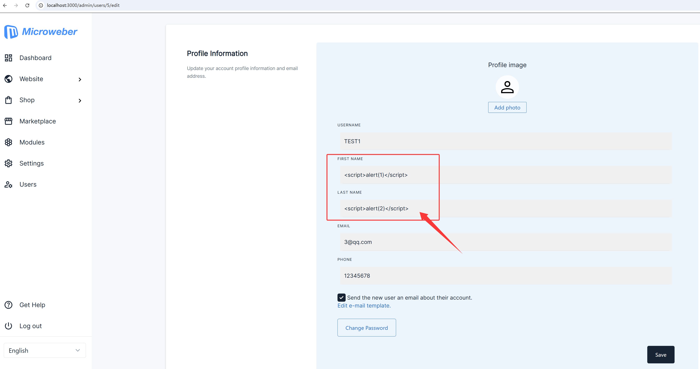
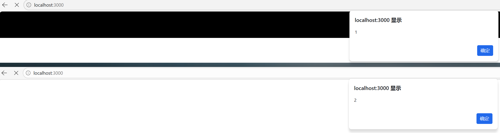
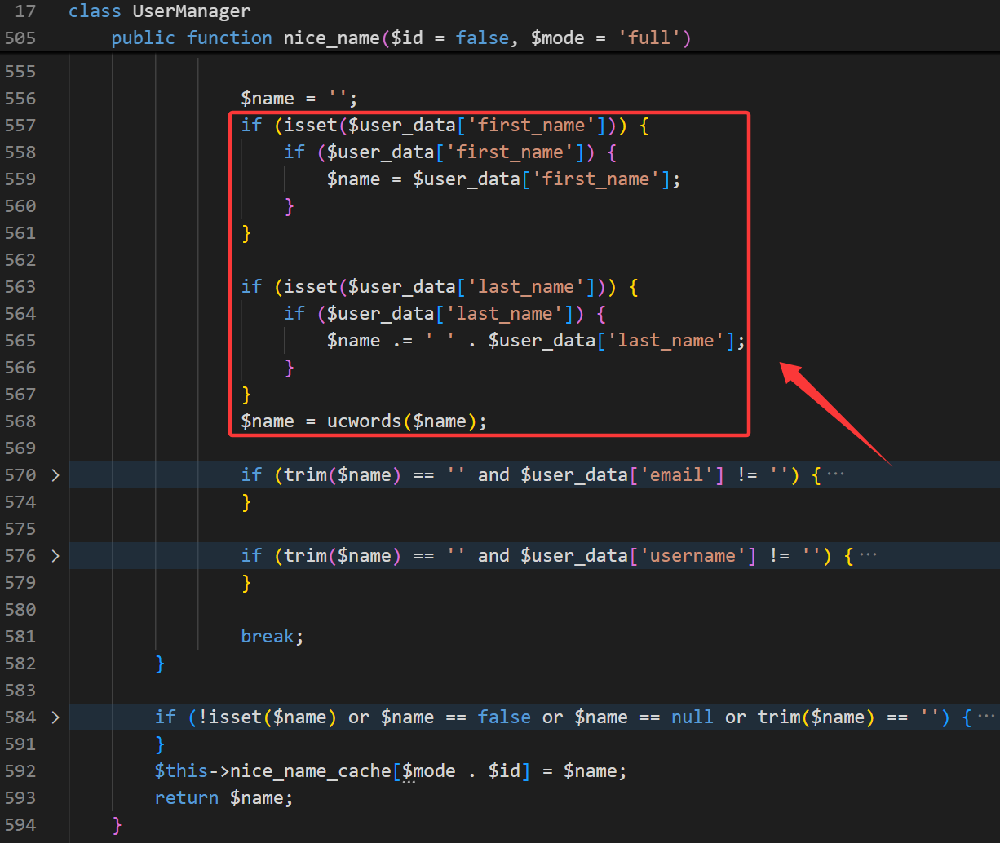
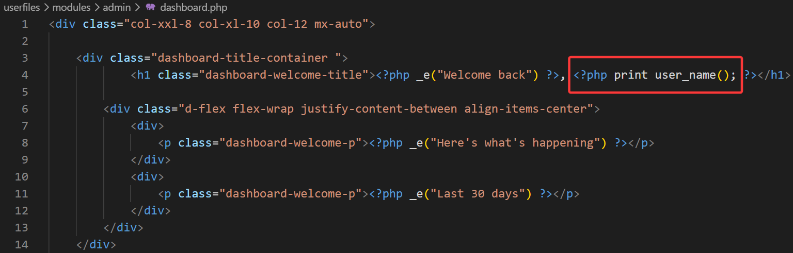

# Stored Cross-Site Scripting in User Profile Name Rendering in Microweber v2.0.20

## Summary

A stored cross-site scripting vulnerability exists in Microweber v2.0.20. The user profile editing functionality does not safely handle attacker-controlled values placed into the `First Name` and `Last Name` fields. When those values are later rendered as part of the user display name, JavaScript can execute in another user's browser.

## Vendor

Microweber

## Product

Microweber

## Affected Version

- Microweber v2.0.20
- Other versions have not been verified yet

## Vulnerability Type

- Stored Cross-Site Scripting
- CWE-79

## Attack Requirements

- Authentication is required
- The attacker must have permission to edit another user's profile

## Affected Functionality

- User profile editing page: `/admin/users/<user-id>/edit`
- User display name rendering logic based on `first_name` and `last_name`

## Technical Details

Microweber builds a user's display name from profile fields such as `first_name` and `last_name`. These values are derived from user-controlled input. In the affected version, attacker-supplied content can be stored in those fields and later rendered into HTML without sufficient output encoding.

As a result, a user who is allowed to edit another user's profile can inject JavaScript into profile name fields and cause code execution when the victim later visits a page that renders the manipulated name.

## Impact

A successful exploit may allow an attacker to execute arbitrary JavaScript in another authenticated user's browser. Depending on the victim's role and session state, this can lead to session compromise, unauthorized actions, data exposure, or further account abuse.

## Reproduction Steps

1. Sign in as an administrator or as any user account that is allowed to edit another user's profile.
2. Open `/admin/users/<user-id>/edit`, where `<user-id>` is the target account.
3. Insert a JavaScript payload into the `First Name` or `Last Name` field.
4. Save the profile.
5. Have the target user sign in and visit a page that renders the manipulated profile name.
6. Observe that the injected script executes in the victim browser.

## Example Payload

```html
<script>alert(1)</script>
```

## Screenshots

### Screenshot 1



### Screenshot 2



### Screenshot 3



### Screenshot 4



## Code References

The following locations were identified during analysis of Microweber v2.0.20:

1. `src/MicroweberPackages/User/UserManager.php`
   `nice_name()` builds the display name from user-controlled fields such as `first_name` and `last_name`.
2. `userfiles/modules/admin/dashboard.php`
   The resulting user name is rendered without sufficient HTML escaping in at least one affected output path.

## Public Risk Description

This issue should be treated as a stored XSS vulnerability rather than a harmless input validation problem because attacker-controlled profile data crosses a trust boundary and later reaches an executable browser context.

## Disclosure Timeline

- Early April 2026: issue reported privately to the vendor by email
- May 14, 2026: no vendor response received
- May 14, 2026: public technical reference prepared for CNA/VulDB review

## Vendor Contact Status

I privately reported this issue to the Microweber maintainers by email in early April 2026. As of May 14, 2026, I have not received any response.

This public document is being provided to support vulnerability review and possible CVE processing.

